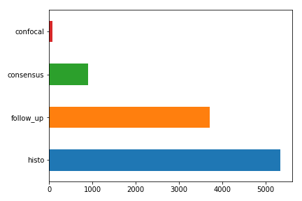
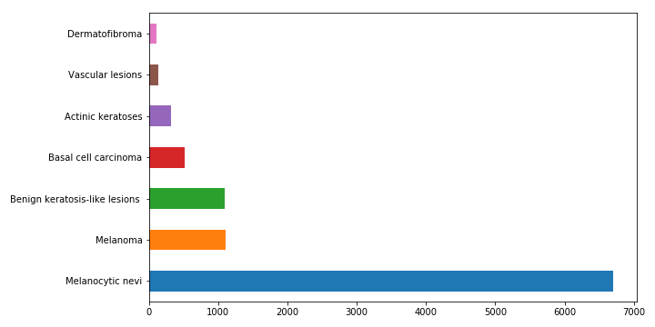
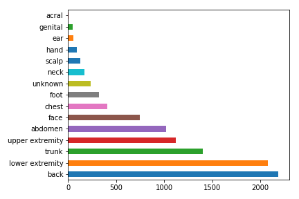
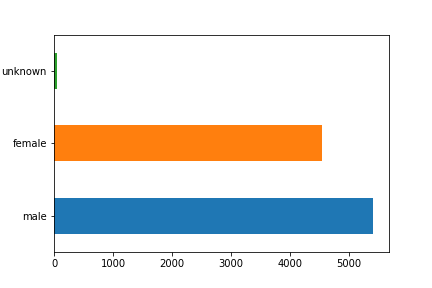
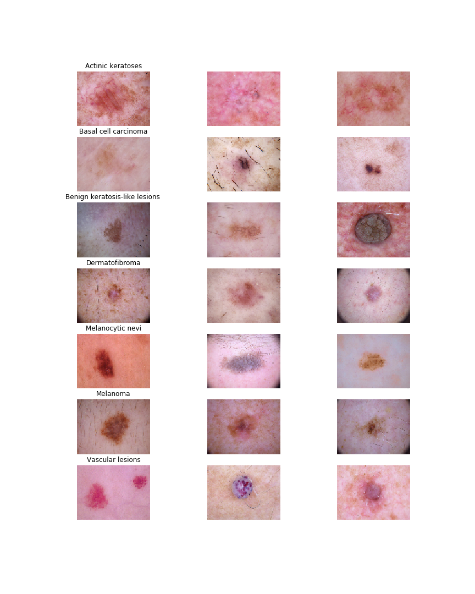
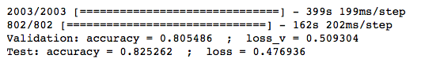
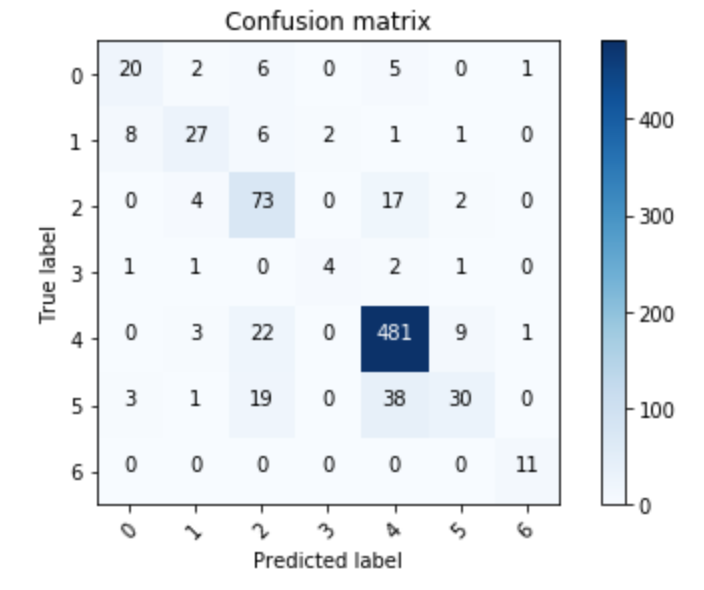

# Final_Project

## Objective
<<<<<<< HEAD
Create a web application that allows users to investigate skin abnormalities such as moles / lesions and determine whether they should visit with a doctor or dermatologist for further testing. 
=======
Create a web application that allows users to investigate skin abnormalities such as moles / lesions displayed in an uploaded image. 
>>>>>>> 094de61d2f3340683fd2f70bc012348ca5283fcd

## Overview
#### What is a mole? 
A mole is officially called a: nevus ( nevi, plural ) in medical jargon.  According to the National Cancer Institute, most people have 10-40 nevi that are harmless.  The majority of pigmented skin lesions are NOT cancerous.  They can a variety of color: pink, tan, brown, black (in people with dark skin), or a color that is very close to a person’s normal skin tone. The color is usually even throughout.   They are usually round or oval. A common mole has a distinct edge that separates it from the rest of the skin. 

Examples of benign skin pigments:
* melasma
* birthmarks
* scars
* post-inflammatory hyperpigmentation
* lentigines
* discoloration from sun damage
* age spots

Examples of malignant skin pigments:
* basal cell carcinoma (BCC)
* actinic keratoses (akiec) or squamous cell carcinoma (SCC)
* melanoma

#### What is Skin Cancer?
Skin cancer is the uncontrolled growth of abnormal skin cells. It occurs when skin cells chromosomal DNA has been damaged by UV light triggering mutations, or genetic defects, that lead the skin cells to multiply uncontrollably to form malignant tumors.

For our application, we leveraged the HAM10000 ("Human Against Machine with 10000 training images") dataset. It consists of 10,015 dermatoscopicimages which are released as a training set for academic machine learning purposes and are publiclyavailable through the ISIC archive. 

#### Benign Lesion Types in the Dataset
##### Common nevi (nv):
Melanocytic nevi are benign neoplasms of melanocytes and appear in a myriad of variants, which all are included in our series. The variants may differ significantly from a dermatoscopic point of view.

##### Benign keratosis (bkl):
"Benign keratosis" is a generic class that includes seborrheic ker- atoses ("senile wart"), solar lentigo - which can be regarded a flat variant of seborrheic keratosis - and lichen-planus like keratoses (LPLK), which corresponds to a seborrheic keratosis or a solar lentigo with inflammation and regression.

##### Vascular skin lesions (vasc):
Vascular skin lesions in the dataset range from cherry angiomas to angiokeratomas and pyogenic granulomas. Hemorrhage is also included in this category.

##### Dermatofibroma (df):
Dermatofibroma is a benign skin lesion regarded as either a benign proliferation or an inflammatory reaction to minimal trauma. It is brown often showing a central zone of fibrosis dermatoscopically.

#### Malignant Lesion Types in the dataset
##### Melanoma (mel):
Melanoma is a malignant neoplasm derived from melanocytes that may appear in different variants. If excised in an early stage, it can be cured by simple surgical excision. Melanomas can be invasive or non-invasive (in situ). 

##### Basal cell carcinoma (bcc):
Basal cell carcinoma is a common variant of epithelial skin cancer that rarely metastasizes but grows destructively if untreated. It appears in different morphologic variants (flat, nodular, pigmented, cystic, etc), which are all included in this set.

##### Actinic Keratoses (akiec):
Actinic Keratoses (Solar Keratoses) and intraepithelial Carcinoma (Bowen’s disease) are common non-invasive, variants of squamous cell carcinoma that can be treated locally without surgery. Some researches regard them as precursors of squamous cell carcinomas and not as actual carcinomas.

## Data Preparation

### Step 1: Importing Libraries
```
%matplotlib inline
import matplotlib.pyplot as plt
import numpy as np
import pandas as pd
import os
from glob import glob
import seaborn as sns
from PIL import Image
np.random.seed(123)
from sklearn.preprocessing import label_binarize
from sklearn.metrics import confusion_matrix
import itertools

import keras
from keras.utils.np_utils import to_categorical # used for converting labels to one-hot-encoding
from keras.models import Sequential
from keras.layers import Dense, Dropout, Flatten, Conv2D, MaxPool2D, DepthwiseConv2D
from keras import backend as K
import itertools
from keras.layers.normalization import BatchNormalization
from keras.utils.np_utils import to_categorical # convert to one-hot-encoding

from keras.optimizers import Adam
from keras.preprocessing.image import ImageDataGenerator
from keras.callbacks import ReduceLROnPlateau
from sklearn.model_selection import train_test_split
```

### Step 2: Data Exploration and Cleanup
Check for missing information `<skin_df.isnull().sum()>`. Only the age column has missing values; therefore, fill in missing values `<skin_df['age'].fillna((skin_df['age'].mean()), inplace=True)>`. 

Exploring the features of the data set:






Loading and resizing of images:

```skin_df['image'] = skin_df['path'].map(lambda x: np.asarray(Image.open(x).resize((100,75))))```



One of the challenges with our chosen data set was the imbalance of the available images. There were four times as many benign images as there were malignant images. We addressed this using an oversampling technique to augment our training image set.


### Step 3:  Building and Training the Model

We used the [Keras Sequential API](https://keras.io/getting-started/sequential-model-guide/) to build our convolutional neural network ("CNN"). The sequential model is a linear stack of layers. We chose to optimize the model using the Adam algorithm. This is an algorithm for first-order gradient-based optimization of stochastic objective functions, based on adaptive estimates of lower-order moments. We chose to address this imbalance by using an oversampling technique to reduce the imbalance.

```
input_shape = (75, 100, 3)
num_classes = 7

model = Sequential()
model.add(Conv2D(256, kernel_size=(3, 3),activation='relu',input_shape=input_shape,padding='same'))
model.add(Conv2D(256, (3, 3), activation='relu',padding='same'))
model.add(LeakyReLU(alpha=0.1))
model.add(MaxPool2D((2, 2),padding='same'))
model.add(Conv2D(256, (3, 3), activation='relu',padding='same'))
model.add(LeakyReLU(alpha=0.1))
model.add(MaxPool2D(pool_size=(2, 2),padding='same'))
model.add(Conv2D(256, (3, 3), activation='relu',padding='same'))
model.add(LeakyReLU(alpha=0.1))                  
model.add(MaxPool2D(pool_size=(2, 2),padding='same'))

model.add(Flatten())
model.add(Dense(128, activation='relu'))
model.add(LeakyReLU(alpha=0.1)) 
model.add(Dense(128, activation='relu'))
model.add(Dense(num_classes, activation='softmax')) 

optimizer = Adam(lr=0.00005, beta_1=0.9, beta_2=0.999, epsilon=None, decay=0.0, amsgrad=False)
model.compile(optimizer = optimizer , loss = "categorical_crossentropy", metrics=["accuracy"])
```


### Step 4: Testing the Model
```
loss, accuracy = skin_model.evaluate(x_test, y_test, verbose=1)
loss_v, accuracy_v = skin_model.evaluate(x_validate, y_validate, verbose=1)
print("Validation: accuracy = %f  ;  loss_v = %f" % (accuracy_v, loss_v))
print("Test: accuracy = %f  ;  loss = %f" % (accuracy, loss))
```



(0 = nv, 1 = mel, 2 = bkl, 3 = bcc, 4 = akiec, 5 = vasc, 6 = df)

## Application Architecture


## Conclusion
* Overall, we achieved 82% categorical accuracy. Our false negative rate (representing missed malignant lesions) for the validation dataset was 18.6%. 

## Future work
* Investigate the use of Region-CNN model to segment the images for the area around each lesion, and then perform a CNN. This should reduce extraneous information fed into the model.
* Use more images to train the model, both for current categories of disease, and for new categories of disease (like Acral lentiginous melanoma). Some of this data is paid, and others require agreements with a university.
* Test how cell phone images of lesions perform in the model. As cell phone images are lower quality and apt to have more skin reflections, the model would need to be further tuned for this application.

## Deployment: Try it Yourself
A working prototype can be found here: [Lesion Legion](http://www.lesionlegion.com)

## Project Team Members

* James Curtis
* Austen Manser
* Bill Nash
* Emanshu Patel
* Erica Unterreiner

## Acknowledgments

* Manu Siddhartha, Step Wise Approach: CCN Model [Kaggle](https://www.kaggle.com/sid321axn/step-wise-approach-cnn-model-77-0344-accuracy)
* Marsh, Skin Lesion Analyzer + Tensorflow.js Web App [Kaggle](https://www.kaggle.com/vbookshelf/skin-lesion-analyzer-tensorflow-js-web-app)
* Tschandl, P., Rosendahl, C. & Kittler, H. The HAM10000 dataset, a large collection of multi-source dermatoscopic images of common pigmented skin lesions. Sci. Data 5, 180161 doi:10.1038/sdata.2018.161 (2018).

## Disclaimer 
The application and all code are provided as technical demonstration, not as medical product.
